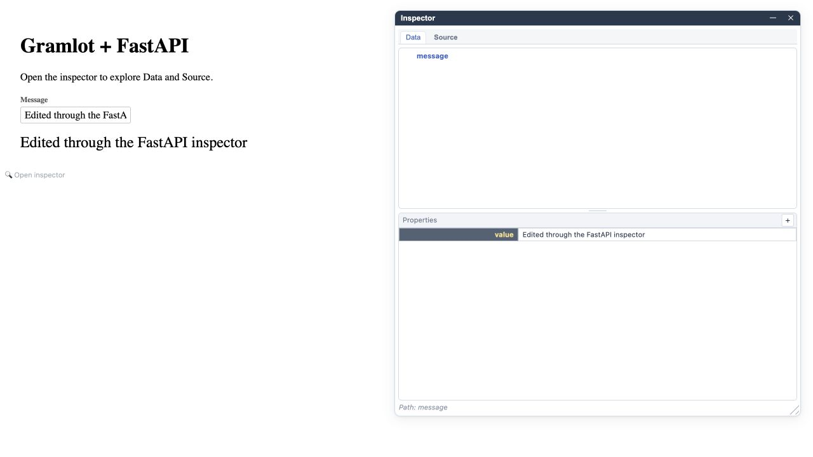

<p align="center">
  
</p>

# gramlot-fastapi

**[Browse the FastAPI adapter source →](src/gramlot_fastapi/)**

The implementation extracted from `gramlot.contrib.fastapi` lives in
`src/gramlot_fastapi`; import it as `gramlot_fastapi`.

- [FastAPI hosting, routes and RPC](src/gramlot_fastapi/application.py)
- [Browser runtime delivery](src/gramlot_fastapi/runtime.py)
- [SQLAlchemy reader: location and current limits](docs/035-sqlalchemy.md)
- [Optional Genropy integration](src/gramlot_fastapi/genropy.py)
- [Development command](src/gramlot_fastapi/__main__.py),
  [examples](examples/) and [behavior tests](tests/)

Gramlot applications hosted by FastAPI.

**Status: experimental preview for evaluating APIs and design choices.**

Documentation describes intended behavior. Bugs, incomplete cases and changing
behavior are expected: passing checks do not guarantee a bug-free product.

Gramlot and this integration are being reviewed and consolidated, with the intent
of reaching a reviewed prerelease soon. No stable contract or release date is
promised. A GitHub prerelease is a distribution label, not architectural acceptance.
Use [gramlot-poc](https://github.com/gramlot-org/gramlot-poc) for the experimental
runtime; [gramlot](https://github.com/gramlot-org/gramlot) will contain the first
consolidated product version and currently defines its constitution and port process.

Read the [overview](docs/005-overview.md), [concise index](docs_llm/index.md), and
[preview installation and release procedure](docs/020-release.md).

## Scope

This repository owns the FastAPI adapter and host-specific classes extracted
from Gramlot. Plain hosting and the Genropy `GnrApp` profile are implemented.
For now, this repository hosts the **FastAPI server adapter** and documentation
explaining SQLAlchemy integration and its current limits. The server-independent
SQLAlchemy adapter belongs to the Gramlot POC: its initial experiment is a read-only
SQLite reader, included in the pinned core wheel with SQLAlchemy optional.
A provisional read-only SQLite profile connects it to pages through
`GramlotApplication(..., db_handler=handler)`. See [SQLAlchemy: scope and status](docs/035-sqlalchemy.md).

The [server and database integration design](docs/040-server-and-database-integration.md)
records the next architectural direction: separate internal adapters, a page-facing
surface, and a standard Gramlot database interface with real and fake adapters.
It distinguishes agreed principles from APIs still to be defined.

## Try the preview

Python 3.11+ and Git are required. In an activated virtual environment:

```sh
python -m pip install 'git+https://github.com/gramlot-org/gramlot-fastapi.git@main'
```

This installs the checksummed Gramlot 0.1.5 core wheel automatically from the
Django preview assets. **0.1.5 identifies that packaged experimental snapshot**;
you do not need a matching source tag or either core checkout. The clean
`gramlot` repository is not yet the executable product. Browser assets are
included in the core wheel, so Node.js is not needed. This repository is public;
no GitHub account is required to download it.
No PyPI release is claimed. See [getting started](docs/getting-started.md) for a
minimal page and [release details](docs/020-release.md) for artifact provenance.

To update an existing preview installation, run the same pip command with
`--upgrade`. See [updating and verifying](docs/getting-started.md#updating-the-preview).

Then start the development host:

```sh
gramlot-fastapi serve /path/to/application
```

Or compose the adapter with an existing application:

```python
from fastapi import FastAPI
from gramlot_fastapi import mount_gramlot

app = FastAPI()
pages = mount_gramlot(app, ".")
```

Use `GramlotApplication` when a ready-made FastAPI subclass is more convenient.
The default page prefix is `/page`.

## Try SQLAlchemy with SQLite

The existing database reader is `gramlot.contrib.sqlalchemy`, included in the
pinned experimental core wheel.
It provides `SqliteDbHandler` and `TableConfig` for **read-only SQLite access**.

Install the optional dependency and run the example from this checkout:

```sh
python -m pip install '.[sqlalchemy]'
python examples/sqlalchemy/serve.py
```

Open <http://127.0.0.1:8000/page/index/>. A `dbSelect` field searches three
demonstration customers in a temporary SQLite database. The connection used
by the application is read-only; the temporary file is removed after shutdown.

The host accepts `db_handler=handler`; pages use the core's `DbPageMixin`.
See [configuration, ownership and limits](docs/035-sqlalchemy.md).
SQLAlchemy is optional and Genropy is not required.

## Genropy profile

The optional legacy integration accepts an initialized `GnrApp` and gives
`GenropyPage` services invocation-scoped access to `self.db`:

```python
from gnr.app.gnrapp import GnrApp
from gramlot_fastapi.genropy import create_genropy_application

app = create_genropy_application(".", genropy_application=GnrApp("my_instance"))
```

Importing `gramlot_fastapi` does not import Genropy. The application environment
must provide its compatible legacy Genropy installation; it is not a dependency
of the plain host. See [SPECIFICATION.md](SPECIFICATION.md) for the ownership
boundary and current limitations.

## Experimental examples

Examples use the experimental Gramlot version maintained in
[gramlot-poc](https://github.com/gramlot-org/gramlot-poc). They will be adapted as
Gramlot evolves and its APIs are reviewed and consolidated. Treat them as
experimental examples, not a stable API reference.

## gramlot.showcase

Run `python examples/showcase/serve.py` from an installed checkout and open
<http://127.0.0.1:8075/>. The first common showcase has a Gramlot page tree and
closable tabs whose iframes preserve one independent page runtime, Source and Data
Bag per example. Each page places the live example beside its real Python source and
has its own inspector lens. No database is required. See
[the showcase guide](docs/045-showcase.md) for behavior, ownership and future ports.

## FastAPI inspector

The shared Gramlot inspector exposes **Data** (page state) and **Source**
(the live UI declaration tree). Edit supported values and see the page react.
Open its magnifying-glass control or press `Ctrl+Shift+D`.



This screenshot comes from [this repository's plain FastAPI page](examples/plain/pages/inspector.py).
The example uses no database. Inspector edits affect the running page; they do
not rewrite Python source or automatically save records.
See the [reproducible inspector guide](docs/025-inspector.md).

## Bonus: genro-bag for other Python projects

Installing this adapter also installs
[`genro-bag`](https://github.com/genropy/genro-bag), the independent Python
library behind Gramlot's Data Bags. Its hierarchical data container and XML
serialization can also help with nested data, configuration and data exchange
outside Gramlot. It does not require FastAPI or a Gramlot interface; it can be
installed separately with `pip install genro-bag`.
See the [genro-bag documentation](https://genro-bag.readthedocs.io).

## Documentation build

Sphinx uses the classic Read the Docs theme with the Gramlot logo. A dedicated CI
workflow builds the guides without installing the adapter or experimental core.
Read the Docs configuration is provided; external project setup is separate.
See [build and hosting instructions](docs/030-readthedocs.md).

Expanded `docs/` and concise `docs_llm/` views follow the
[paired documentation policy](docs/015-documentation.md).

## Development

```sh
git clone https://github.com/gramlot-org/gramlot-fastapi.git
cd gramlot-fastapi
uv sync --extra dev --extra docs
uv run python scripts/check.py
uv run python -m build
uv run python -m twine check dist/*
git config core.hooksPath hooks
```

Python 3.11+; Hatchling build backend; pytest, Ruff and advisory mypy; Sphinx
with Markdown support. `uv.lock` records
the development environment. A pip-based setup is also supported:
`python -m pip install -e '.[dev,docs]'`.

## Layout

- `src/gramlot_fastapi/`: FastAPI adapter, browser delivery and Genropy profile.
- `tests/`: routing, RPC, runtime distribution and Genropy lifecycle tests.
- `examples/`: Python-authored database-profile examples.
- `docs/`: Sphinx documentation.
- `hooks/`: pre-commit lint/advisory typing and pre-push checks.
- `.github/workflows/`: package and documentation checks.

`main` contains the published POC source; use `develop` for new work. No automatic
package publication or deployment is configured. Read the Docs configuration
is provided, but its external service has not been connected.

## Checks

```sh
uv run python scripts/check.py
uv run mypy src/  # advisory
uv run python -m sphinx -W --keep-going -b html docs docs/_build/html
```

Pytest is mandatory and failures block the checks. CI also builds and installs
the wheel in a separate environment to verify packaging. Development currently
pins the Gramlot 0.1.5 API. CI uses the checksummed core wheel distributed with
the Django preview and verifies the installed adapter outside source checkouts.

## License

Apache License 2.0. Copyright 2026 Softwell S.r.l. See LICENSE and NOTICE.
