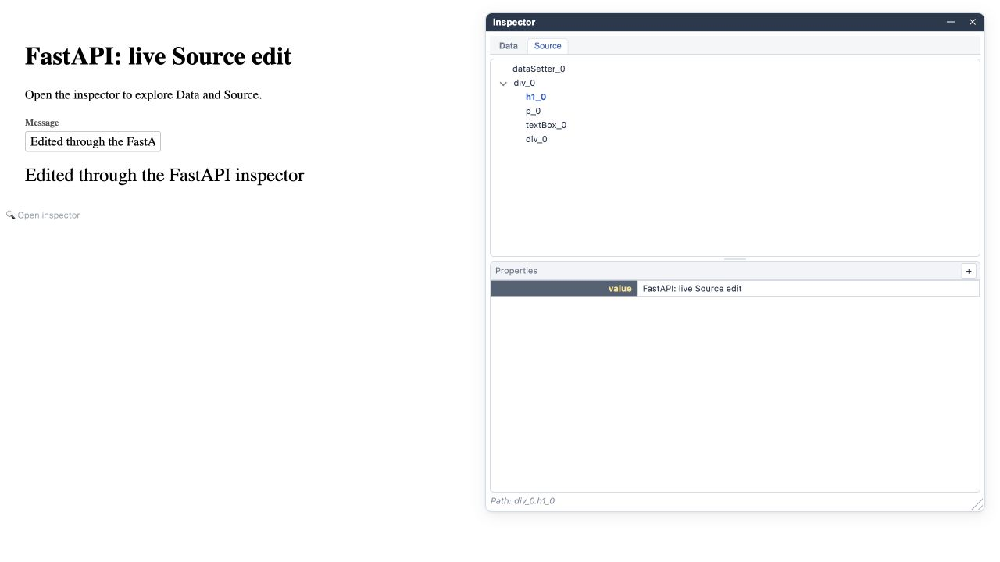

# FastAPI inspector

Historical PoC guide: the inspector and CLI below use APIs outside clean
Gramlot 0.1.0. See [GF-050](050-native-html.md) for the native host.

Document ID: **GF-025**.

[Concise counterpart](https://github.com/gramlot-org/gramlot-fastapi/blob/main/docs_llm/025-inspector.md).

<a id="1-run-the-example"></a>
<a id="gf-025-005"></a>

## 005 · Run the example

Block ID: **GF-025-005**.

The inspector belongs to the shared Gramlot browser runtime delivered by FastAPI.
Both screenshots below were captured from this repository's plain FastAPI example,
without a database adapter.

After installing the preview, run from this repository's checkout:

```sh
gramlot-fastapi serve examples/plain
```

Open <http://127.0.0.1:8000/page/inspector/>.
The Python declaration is in
[`examples/plain/pages/inspector.py`](https://github.com/gramlot-org/gramlot-fastapi/blob/main/examples/plain/pages/inspector.py).
It initializes a `message` Data node and binds both a text field and a text display
to it. These are experimental APIs and may change.

<a id="2-explore-and-edit-data"></a>
<a id="gf-025-010"></a>

## 010 · Explore and edit Data

Block ID: **GF-025-010**.

Open the magnifying-glass control or press `Ctrl+Shift+D`.
Select **Data**, then the `message` node. In Properties, change its value and
leave the property row to commit the edit.


Here the value was changed to `Edited through the FastAPI inspector`.
Both the bound field and the text below it reflect the change.
Data is the running page's state; this example performs no database operation.

<a id="3-explore-and-edit-source"></a>
<a id="gf-025-015"></a>

## 015 · Explore and edit Source

Block ID: **GF-025-015**.

Select **Source**, expand `div_0` and select its `h1_0` child.
Edit the value in Properties and leave the row.



Here the heading value was changed to `FastAPI: live Source edit`.
Source is the live UI declaration tree generated from the Python page.

<a id="4-lifetime-and-boundaries"></a>
<a id="gf-025-020"></a>

## 020 · Lifetime and boundaries

Block ID: **GF-025-020**.

Inspector edits affect the current running page. They do not rewrite Python files
or automatically persist database records. Reloading or rebuilding the page can
replace them; application bindings and controllers can also react to edits.

A page can set `source_inspection = False` to disable its inspector in the startup
configuration. This controls presentation; it is not an authorization boundary
for server methods or database access.

For database integration, see [SQLAlchemy status](035-sqlalchemy.md) and
[server/database architecture](010-architecture.md).
